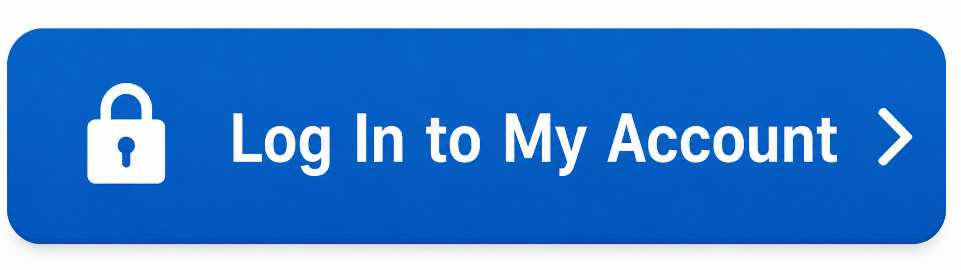

American Express Log In My Account | Sign In Guide
==================================================

American Express Log In My Account gives cardholders secure online access to their accounts. After signing in, you can check your balance, review recent transactions, make payments, download statements, manage your cards, redeem eligible rewards, and update your account information—all from one secure dashboard. If you're having trouble signing in, this guide covers the login steps, common issues, and quick solutions to help you access your account safely.

Sign In to Your American Express Account
----------------------------------------

Follow these simple steps:

#. Go to the official American Express sign-in page.
#. Enter your **User ID**.
#. Type your **Password**.
#. Click **Log In**.
#. Complete any security verification if prompted.

Once signed in, you'll have access to your account dashboard.

What You Can Do After Signing In
--------------------------------

After logging in, you can:

* View your account balance.
* Check recent transactions.
* Make or schedule payments.
* Download account statements.
* Manage your American Express Cards.
* Redeem eligible rewards.
* Update your personal information.

Can't Sign In?
--------------

If you're having trouble accessing your account, try the following:

* Check that your User ID and Password are correct.
* Use the **Forgot User ID or Password** option.
* Clear your browser's cache and cookies.
* Try a different browser or device.
* Make sure your internet connection is stable.

Reset Your User ID or Password
------------------------------

If you've forgotten your login details, select **Forgot User ID or Password** on the sign-in page. Follow the verification steps to reset your credentials and regain access to your account.

Keep Your Account Secure
------------------------

* Use a strong, unique password.
* Never share your login information.
* Sign out after using a public or shared device.
* Keep your browser or mobile app up to date.
